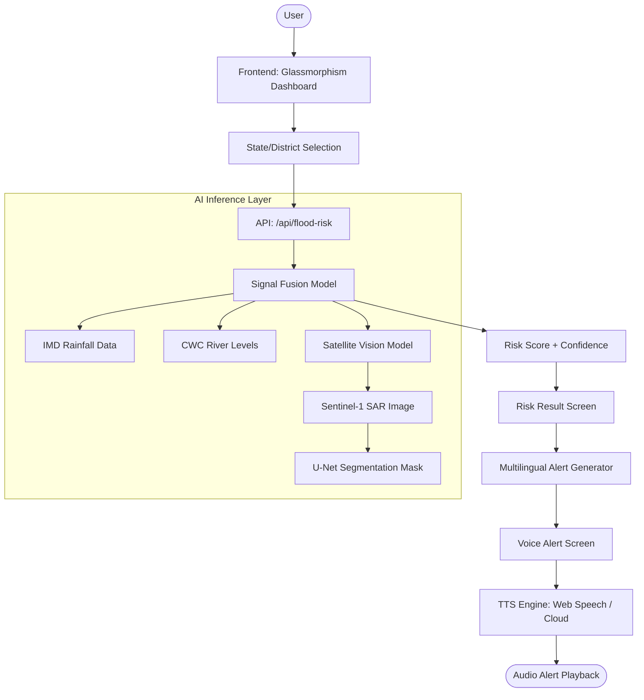

# JalRakshak: Technical Architecture Document

## 1. System Flow Diagram

## 2. Core Components

### 2.1 Frontend Layer
- **Interface**: High-end glassmorphism UI designed for high readability in emergency contexts.
- **Multilingual Support**: Real-time switching between English, Assamese, Bengali, and Hindi.
- **Client-side API**: Mandatory implementation of `getFloodRisk()` and `playVoiceAlert()`.

### 2.2 AI Inference Layer
- **Satellite Water Mask (Vision)**:
  - **Model**: Pretrained U-Net or SegNet architecture.
  - **Input**: Sentinel-1 Synthetic Aperture Radar (SAR) imagery.
  - **Utility**: Detection of water-spread in cloud-covered monsoon conditions.
- **Risk Fusion (Heuristic/ML)**:
  - Weightage-based fusion of Rainfall departure, River level trend, and Satellite water pixels.

### 2.3 Audio Alert Generation
- **Context-Aware TTS**: Converts technical risk parameters into human-friendly instructions.
- **Native Dialects**: Prioritizes regional phonetics for North-East pilot usability.

## 3. Data Sources & Privacy
- **Datasets**: IMD Climate Records, CWC Hydrological Gauges, OGD India Open Data.
- **Privacy**: No PII (Personally Identifiable Information) is stored. The system is stateless and compliant with DPDP guidelines.

## 4. Scalability for North East Pilot
- **District Cells**: Designed to be used by District Disaster Management Authorities (DDMA) for rapid dissemination.
- **Deployment**: Lightweight JS/HTML frontend allows for low-bandwidth usage in remote regions.
