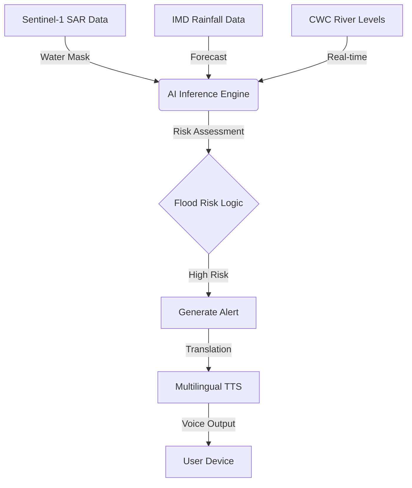

# JalRakshak: Voice-First Flood Guardian for the North East

JalRakshak is an AI-powered flood intelligence tool designed to convert satellite water-mask inference and public climate data into actionable, multilingual voice alerts for last-mile disaster response in North-East India.

## Core Features
- **Satellite Water Mask Interpretation**: Analyzes Sentinel-1 SAR imagery to detect water-spread anomalies.
- **AI Signal Fusion**: Combines IMD rainfall data and CWC river level records for accurate risk assessment.
- **Multilingual Voice Alerts**: Generates live alerts in Assamese, Bengali, Hindi, and English.
- **Zero Data Retention**: Privacy-first architecture with no personal data storage.

## Impact on North East India
The North East region faces unique flood challenges due to rapid river swelling and complex topography. JalRakshak addresses this by:
- **Last-Mile Connectivity**: Delivering voice alerts in local languages (Assamese, Bengali) for communities with low literacy.
- **Privacy First**: Ensuring compatibility with the Digital Personal Data Protection (DPDP) Act by storing no user data.
- **Resiliency**: Lightweight architecture designed to work on low-bandwidth networks typical in the NER.

## System Architecture

## Dataset Strategy
We leverage open government and scientific datasets to ensure accuracy and scalability:
1.  **Sentinel-1 SAR**: Used for real-time water mask interpretation (simulated for prototype).
2.  **IMD (India Meteorological Department)**: Rainfall history and forecasts for predictive modeling.
3.  **CWC (Central Water Commission)**: Real-time river gauge levels for validation.

## Folder Structure
- `/frontend`: Responsive web UI (HTML, CSS, JS).
- `/data`: Sample public datasets (IMD Rainfall, CWC River Levels).
- `/src/app/api`: AI inference endpoints (Next.js).

## Tech Stack
- **Frontend**: Next.js 15, React 19, Tailwind CSS, Framer Motion.
- **AI/ML**: Simulated Vision (SAR Mask) and Hydrological Fusion models.
- **Voice**: Web Speech API + Simulated TTS API.
- **Data**: Public IMD/CWC records (CSV).

## Run Instructions
1. Clone the repository.
2. Run `npm install`.
3. Run `npm run dev`.
4. Navigate to `http://localhost:3000`.

## Dataset Sources
- **IMD**: Rainfall history and forecasts.
- **CWC**: Real-time river gauge levels.
- **Sentinel-1**: SAR radar imagery for flood mapping.

## Team
- Built for IndiaAI mission alignment and pilot testing in Assam/North-East disaster cells.
