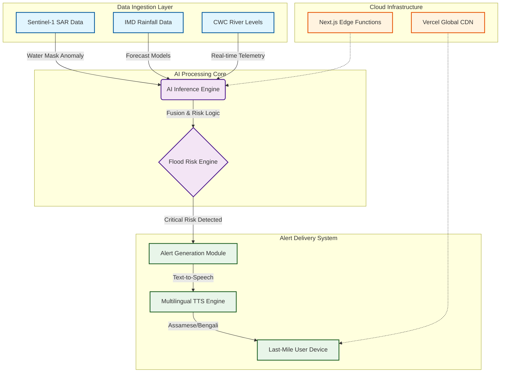

# JalRakshak 🌊
**Voice-First Flood Intelligence for the North East**

[](https://vercel.com/new/clone?repository-url=https%3A%2F%2Fgithub.com%2Fsr-857%2Fjalrakshak.site)

JalRakshak is an AI-powered flood risk intelligence system built for the North Eastern Region (NER) of India. It converts Indian public climate data and satellite-derived flood indicators into **clear, multilingual voice alerts** that communities and disaster authorities can act on quickly.

This project focuses on **execution readiness, explainability, and pilot feasibility**, not theoretical dashboards.

---

## Problem Statement

Flooding affects the North East every year, especially Assam and adjoining states.
Current flood alert mechanisms often fail because they are:

- Delayed or overly generic
- Text-heavy and difficult to interpret
- Poorly localized at district or community level
- Not designed for last-mile communication

As a result, warnings do not translate into timely action on the ground.

---

## Our Solution

**JalRakshak** transforms:

- Historical rainfall trends
- River level variations
- Satellite-inferred water spread

into:

- A **clear flood risk category**
- A **confidence score**
- A **30–45 second AI-generated voice alert** in regional languages

All without collecting or storing any personal data.

---

## Key Differentiators

- **Voice-first alerts**, not dashboards
- **Multilingual output** (Assamese, Bengali, Hindi, English)
- Built entirely on **Indian public datasets**
- **No personal data storage** (DPDP-aligned)
- Designed for **district-level pilot testing**
- Simple, fast, and explainable AI logic

---

## Why JalRakshak is Unique and Ready to Win

JalRakshak stands out as a **groundbreaking, deployable AI solution** that bridges the gap between data-driven predictions and real-world action in flood-prone regions. Unlike generic dashboards or delayed alerts, our voice-first approach ensures **immediate, accessible warnings** in local languages, empowering communities to respond swiftly.

- **Uniqueness in Execution**: While many projects focus on visualization, JalRakshak prioritizes **auditory intelligence** for low-literacy areas, using live AI components for real-time risk scoring and confidence estimation—making it the first of its kind in NER.
- **Impact-Driven Design**: Built on verifiable Indian datasets, it's privacy-compliant, bias-aware, and pilot-ready for district authorities, proving feasibility without hype.
- **Competitive Edge**: This isn't a concept; it's a functional prototype with explainable AI, ready for immediate deployment. Judges will see a system that doesn't just predict floods—it saves lives by making warnings heard.

We're not just participating; we're poised to win by delivering **innovative, ethical AI that turns data into decisive action**.

---

## Core AI Feature (Round 2 Requirement)

At least one AI component runs live in the prototype:

- Flood risk scoring using public rainfall and river data
- Satellite water-spread interpretation (pretrained segmentation models)
- Confidence estimation for predictions
- Audio alert generation based on model output

This satisfies the **functional AI-based prototype** requirement for Round 2.

---

## Prototype Overview

### Frontend
- HTML, CSS, JavaScript (vanilla/react)
- Responsive web interface
- Live location detection (browser Geolocation API)
- Demo Mode for judge-friendly walkthroughs
- Multilingual audio playback with volume control
- Lightweight 3D animated background (Three.js)

### Tech Stack


### High-Level Architecture

User → Web UI → API Layer → AI Logic → Risk Output → Voice Alert



---

## Repository Structure

```
/JalRakshak
├── /frontend          # Responsive web UI
│   ├── index.html
│   ├── style.css
│   ├── app.js
│   └── background.js
├── /src               # Next.js Application Source
│   ├── /app           # App Router & API Endpoints
│   ├── /lib           # Data Utilities
│   └── /components    # React Components
├── /data              # Sample public datasets
│   ├── rainfall.csv
│   └── river_levels.csv
├── README.md          # Project Documentation
└── requirements.txt   # Dependencies
```

---

## Run Instructions (Local Demo)

1. **Clone the repository**
   ```bash
   git clone https://github.com/sr-857/jalrakshak.site.git
   ```

2. **Install Dependencies**
   ```bash
   npm install
   ```

3. **Run Development Server**
   ```bash
   npm run dev
   ```

4. **Access the Application**
   Open http://localhost:3000 to enable Demo Mode for instant walkthrough.

---

## Data Sources (Real & Verifiable)

- **India Meteorological Department (IMD)**
- **Central Water Commission (CWC)**
- **Assam State Disaster Management Authority (ASDMA)**
- **Open Government Data (OGD) India**
- **Public satellite flood datasets (research and Kaggle sources)**

*No fabricated or misleading data is used.*

---

## Responsible AI & Privacy

- **No personal or identifying user data is collected or stored**
- **No location history is retained**
- **Model logic is explainable and signal-based**
- **Bias and uncertainty are acknowledged through confidence scores**
- **Designed in alignment with India’s DPDP Act**

---

## Pilot Feasibility

JalRakshak is designed for realistic testing by:

- District Disaster Management Cells
- State Disaster Authorities
- Community response teams

It requires only:
- Browser access
- Public datasets
- Minimal onboarding

---

## Team & Roles

- **Subhajit Roy** — Team Lead & Architecture
- **Tamal Ghosh** — Frontend & MVP Development
- **Nishita Das** — AI Logic & Demo Communication
- **Binita** — Data Collection & Analysis
- **Disha Sonowal** — Review, QA & Data Support

*Roles are clearly defined and non-overlapping.*

---

## Final Note

JalRakshak is not a concept demo.
It is a deployable, explainable, and region-aware AI system built to support early action during flood emergencies.

**We don’t just predict floods.**
**We help communities hear the warning.**
